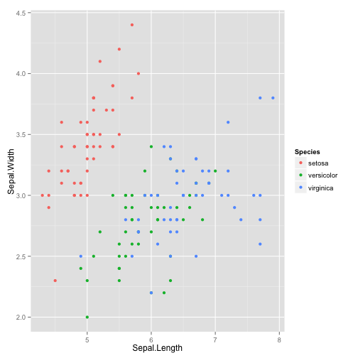
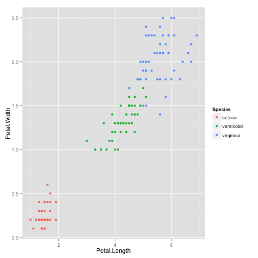

Iris Dataset Explorer
========================================================
author: Lim Jie Feng Kenneth
date: 13 September 2015

Iris Dataset Explorer: About
========================================================

Have you ever wanted to study and understand more about various Iris flower species,
but did not know where or how to get started?

Have you ever stumbled upon R, Python, or Excel, finding that it's just a tedious
task to write your own code or to analyze the Iris dataset?

As a flower lover, have you ever wondered why you have to go through all these pain
and complexity to be closer to your beloved Iris flowers?

Iris Dataset Explorer: Introduction
========================================================

Introducing **Iris Dataset Explorer**, a simple way to study, analyze and learn about
Iris flowers.

Become an Iris flower subject matter expert in no time!

Features:
* Interactive Data Table for a sample of 150 Iris flowers
* Species prediction based on user inputs
* Multiple graph plots on Iris flower properties

Iris Dataset Explorer: Real-time Prediction
========================================================

**Iris Dataset Explorer** contains a Species prediction engine. It uses
random forest that gives you the result in realtime.

How it works behind the scenes:

<font size="6px">

```r
modRF = train(Species ~ ., data=iris, method='rf')
predict(modRF, data.frame(
  Sepal.Length=c(3.5),
  Sepal.Width=c(2.5),
  Petal.Length=c(4.5),
  Petal.Width=c(8.0)
))
```

```
[1] virginica
Levels: setosa versicolor virginica
```
</font>

Iris Dataset Explorer: Sample Graph Plots
========================================================
left: 50%



***


